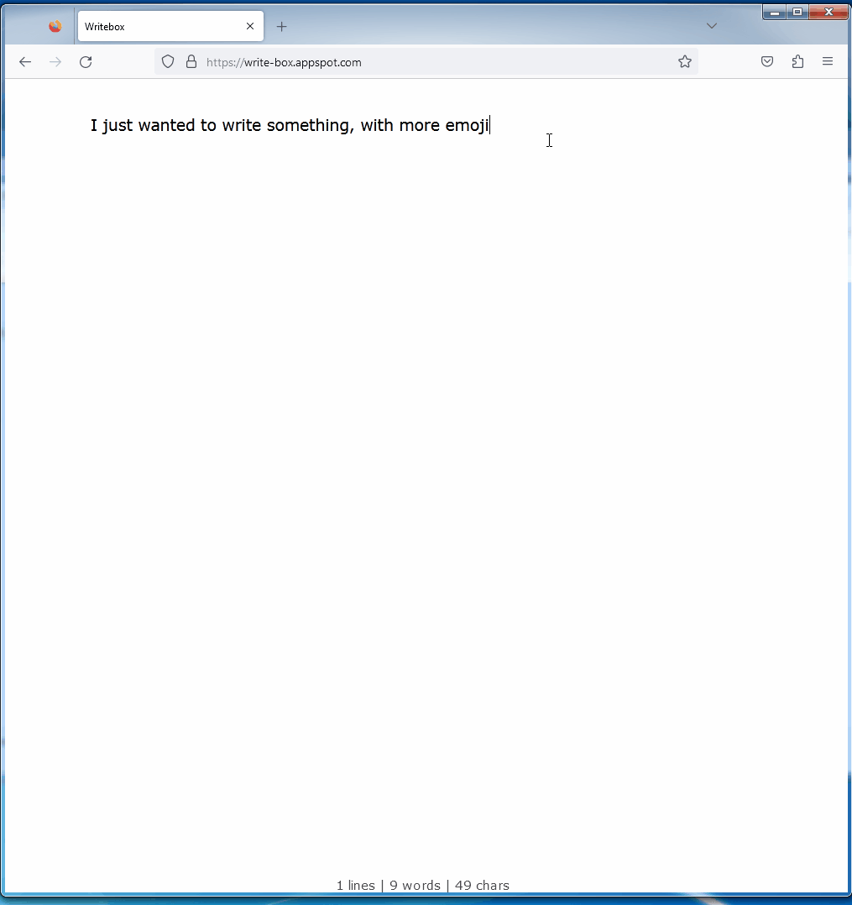

# <image src="./assets/ico-48.png" style="vertical-align: middle"> Emoji Picker 

This is a simple emoji picker that replaces the emoji picker in Windows ≥10.

This is still a work in progress, but as a beginner Rustacean, a few milestones (including making a DLL Windows hook in Rust) have been achieved.

## Demo

<center>


</center>

## Running

* Tested on Windows 11, MSVC toolchain.

```bash
git clone --recurse-submodules git@github.com:Maeeen/emoji-picker.git
cd emoji-picker
cargo run
```

## Goal

This executable should behave in the same manner as the Windows Emoji Picker, with the main goal of:
- having the same shortcut (achieved by using a `WH_KEYBOARD_LL` Windows hook)
- having the same behavior : focus to the main window is not lost when the picker is opened, and the picker closes when the focus is lost.

## Features

All these features are for Windows only. They will have no effect if not running on Windows.

* `caret`: will place the window near the caret (cursor) position.
* `no-activate`/`key-redir`: will not activate the window when opened, focus will not be lost when the picker is opened.
* `key-shortcut`: will open the picker with the <kbd>Win</kbd> + <kbd>.</kbd> shortcut.

## Targets

* The main target is Windows 11, but it should work on older versions of Windows as well. No need for administrator privileges.
* On Linux/macOS, there is no strict requirement for this but the missing implementations are:
  * [ ] The keyboard shortcut to open the picker. (<kbd>Win</kbd> + <kbd>.</kbd>) (`src/key_shortcut.rs`)
  * [ ] The “key interceptor” that prevents focus being made to the Emoji Picker window AND intercepts every key made while the picker is open.

## Features

* Replaces the painfully slow and bloated Windows emoji picker (personal opinion.)
* You can tweak it to your liking (since this is fully public.)

## Caveats

There is many caveats when programming this kind of Windows application in Rust:
- a shit ton of `unsafe` tags

## TO-DO

* [ ] Emoji groups
* [x] A tray-icon (maybe?) Not a good idea to have a process floating around without showing its existence to the user.
* [ ] On lost focus, close the picker. As of right now, only pressing <kbd>Esc</kbd> closes the picker.
* [ ] Better readme and showcase
* [ ] The search text input should be automatically focused on opening
* [ ] `caret_locator` places the window in the screen's bbox
* [ ] Doing the TODOs in code
* [ ] Lost focus closes the picker
* [ ] Customize emoji image source
  + Currently, the app uses [`jdecked/twemoji`](https://github.com/jdecked/twemoji) for the emojis along with the [`emojis` crate](https://crates.io/crates/emojis). In the future,
    it would be a good idea to not make it a submodule, as it requires manually updating the submodule (maybe?)
* [ ] Customize shortcuts (when opening the picker.)
* [ ] Maybe Linux support?